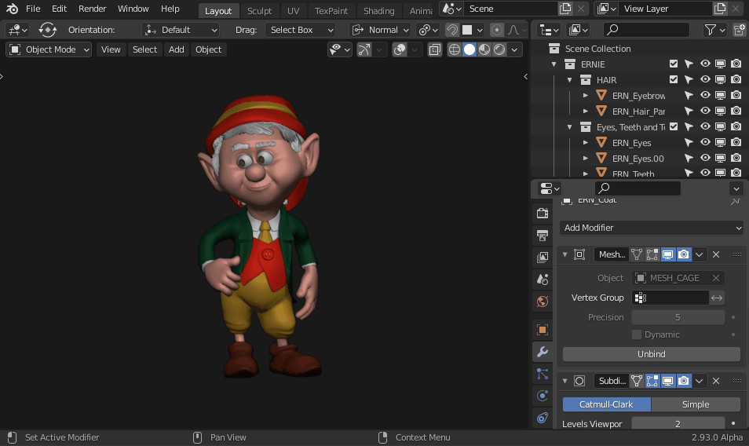

# Editor Swap (Blender Addon) 
Are you searching for a quick way to swap between editors

You need more space? For example joining the outliner and properties editor?

## What is this addon for? 
This addon will allow you to exchange editors with a button or a shortcut. The linking between editors is fully configurable. You can swap between two or more editors sequentially.

Additionally you can also hide the button if you prefer only to use the shortcut. You can also assign the shortcut of your preference.
 

  

## Supported versions of Blender

I have tested the addon with 2.83, 2.90, 2.91, 2.92 and 2.93 alpha. If you have a problem with any of those versions, please let me know. 

## Usage

Click on button on headers of editors, or use the shortcut.

## What is the default shortcut?
### CTRL + ALT + X
Also you can change the shortcut on keymap prefs, on "Window" panel.

## Editor Swap 1.0 

  

## Instalation
1. Go to addon page on Gumroad: https://gumroad.com/l/editorswap
2. Download the zip file "editor_swap_[version].py"
3. Go to Blender > User Preferences > Addons > Install 
4. Select the downloaded file.
5. Activate the addon.
6. Enjoy it!

## Support

You can support my work by buying this plugin on this page.