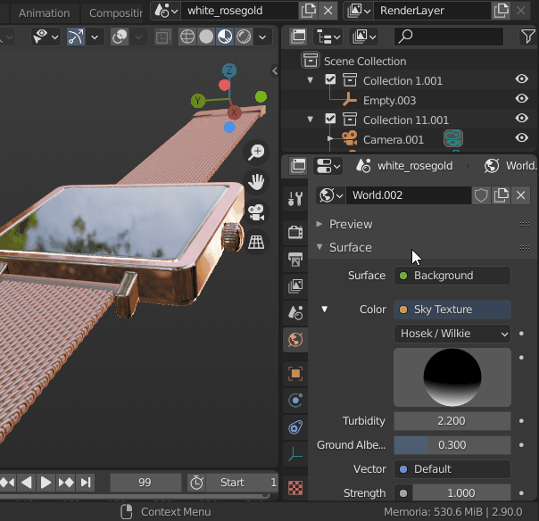

# Fast Switcher (Blender Addon) 
Fast switching between Outliner/Properties and Dopesheet/GraphEditor.
 
Especially useful on small screens to benefit of vertical space (in the case of Outliner / Properties).
  

## Instalation
1. On this page, go to Code > Download ZIP and save it on your computer.  
2. Extract the ZIP file..
3. Go to Blender > User Preferences > Addons > Install 
4. Select the python file "fast.switcher.py"
5. Activate the addon.
6. In some cases, after installing, it is necessary to hover the mouse over the area to refresh it.
7. Enjoy it!
