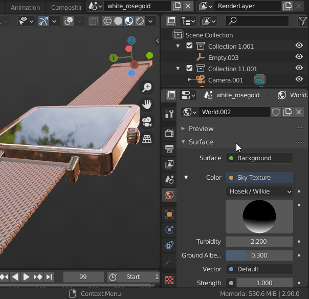

# Quick Editor Switch (Blender Addon) 
Quick switching between Editors. 
 
- Suported Editors
    - Image / UV
    - Shader / Compositor
    - VSE / ClipEditor
    - DopeSheet / GraphEditor
    - Timeline / Info
    - Drivers / NLA
    - TextEditor / PythonConsole
    - Outliner / Properties

 

## Instalation
1. On this page, go to Code > Download ZIP and save it on your computer.  
2. Extract the ZIP file..
3. Go to Blender > User Preferences > Addons > Install 
4. Select the python file "quick_editor_switch.py"
5. Activate the addon.
6. In some cases, after installing, it is necessary to hover the mouse over the area to refresh it.
7. Enjoy it!
